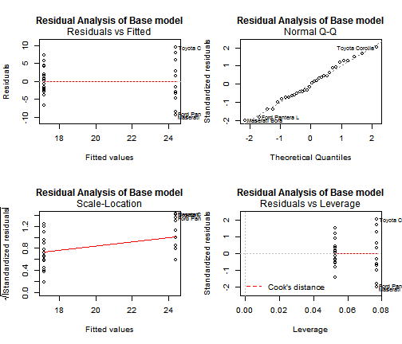

Fuel Economy and Analysis of Motor Trend Data Transmissions
========================================================

## Executive Summary

The contribution of automatic or manual transmissions (AM) to miles per gallon (MPG) was analyzed using the 1974 _Motor Trend Magazine_ data of 11 variables on 32 automobiles.  The resulting analysis of the _mtcars_ dataset in the standard R datasets package indicate:

- Cars with manual transmissions had better MPGs than automatic transmissions
- Holding all other variables constant, cars with manual transmissions had x.xxx MPG better fuel economy
- There were sevaral confounding variables including yyy, zzz which were included in the final model beyond transmission type
- The final model explained xxx of the variance as described by the $R^2$ value
- more
- more

## Data Transformation and Exploration

Several of the 11 variables in the dataset were initially numeric and had to be transformed into factor variables to be appropriately analyzed.


```r
mtcars$am <- factor(mtcars$am, levels = c(0, 1), labels = c("Automatic", "Manual"))
mtcars$cyl <- factor(mtcars$cyl)
mtcars$vs <- factor(mtcars$vs)
```

As can be seen in __Appendix Figure 1__, considering no other variables, there is a significant difference in MPG based on transmission type.

## Linear Models and Selection

A baseline model was initially developed using just trasmission type and MPG.

```r
(summaryBaselm <- summary(baselm <- lm(mpg ~ am, data = mtcars)))
```

```
## 
## Call:
## lm(formula = mpg ~ am, data = mtcars)
## 
## Residuals:
##    Min     1Q Median     3Q    Max 
## -9.392 -3.092 -0.297  3.244  9.508 
## 
## Coefficients:
##             Estimate Std. Error t value Pr(>|t|)    
## (Intercept)    17.15       1.12   15.25  1.1e-15 ***
## amManual        7.24       1.76    4.11  0.00029 ***
## ---
## Signif. codes:  0 '***' 0.001 '**' 0.01 '*' 0.05 '.' 0.1 ' ' 1
## 
## Residual standard error: 4.9 on 30 degrees of freedom
## Multiple R-squared:  0.36,	Adjusted R-squared:  0.338 
## F-statistic: 16.9 on 1 and 30 DF,  p-value: 0.000285
```

```r
(ciBaselm <- confint(baselm))  # confidence intervals of the coefficients
```

```
##              2.5 % 97.5 %
## (Intercept) 14.851  19.44
## amManual     3.642  10.85
```

As can be seen, with no other variables there is a statistically significant difference of 7.2449 increase in MPG for manual transmissions (p=0.000285 , conf interval= (3.6415 to 10.8484)). However, the model only explains 0.3598 of the variance in mpg based on the $R^2$ value.

## Conclusions


## Appendix
The following information is availabe as an appendix for review.

 

Figure 1: Automatic vs. Manual transmissions and Miles per Gallon with no other variables

 

Figure 2: Residuals analysis of base model including just mpg and transmission type


```r
summary(mtcars)
```

```
##       mpg       cyl         disp             hp             drat     
##  Min.   :10.4   4:11   Min.   : 71.1   Min.   : 52.0   Min.   :2.76  
##  1st Qu.:15.4   6: 7   1st Qu.:120.8   1st Qu.: 96.5   1st Qu.:3.08  
##  Median :19.2   8:14   Median :196.3   Median :123.0   Median :3.69  
##  Mean   :20.1          Mean   :230.7   Mean   :146.7   Mean   :3.60  
##  3rd Qu.:22.8          3rd Qu.:326.0   3rd Qu.:180.0   3rd Qu.:3.92  
##  Max.   :33.9          Max.   :472.0   Max.   :335.0   Max.   :4.93  
##        wt            qsec      vs             am          gear     
##  Min.   :1.51   Min.   :14.5   0:18   Automatic:19   Min.   :3.00  
##  1st Qu.:2.58   1st Qu.:16.9   1:14   Manual   :13   1st Qu.:3.00  
##  Median :3.33   Median :17.7                         Median :4.00  
##  Mean   :3.22   Mean   :17.8                         Mean   :3.69  
##  3rd Qu.:3.61   3rd Qu.:18.9                         3rd Qu.:4.00  
##  Max.   :5.42   Max.   :22.9                         Max.   :5.00  
##       carb     
##  Min.   :1.00  
##  1st Qu.:2.00  
##  Median :2.00  
##  Mean   :2.81  
##  3rd Qu.:4.00  
##  Max.   :8.00
```

