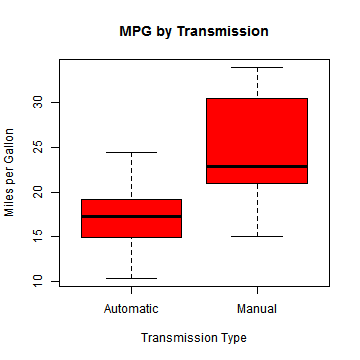
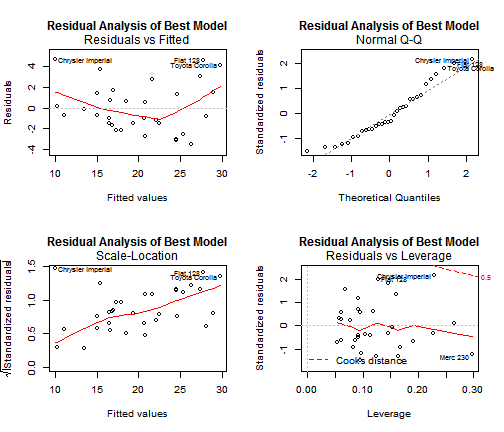

Fuel Economy and Analysis of Motor Trend Data Transmissions
========================================================

## Executive Summary

The contribution of automatic or manual transmissions (AM) to miles per gallon (MPG) was analyzed using the 1974 _Motor Trend Magazine_ data of 11 variables on 32 automobiles.  The resulting analysis of the _mtcars_ dataset in the standard R datasets package indicate:

- Cars with manual transmissions had better MPGs than automatic transmissions
- Holding all other variables constant, cars with manual transmissions had 7.25 MPG better fuel economy
- There were several confounding variables including weight in lbs/1000 and quarter mile time in seconds which were included in the final model in addition to transmission type
- The final model explained nearly 0.85 of the variance as described by the $R^2$ value
- In the final model including these additional variables, manual transmissions had better mileage but only about 2.9 MPG different than automatic transmission cars holding all other variables constant

## Data Transformation and Exploration

Several of the 11 variables in the dataset were initially numeric and had to be transformed into factor variables to be appropriately analyzed.


```r
library(car)
mtcars <- datasets::mtcars  # start with the baseline data from the datasets package
mtcars$am <- factor(mtcars$am, levels = c(0, 1), labels = c("Automatic", "Manual"))
mtcars$cyl <- factor(mtcars$cyl)
mtcars$vs <- factor(mtcars$vs)
```

As can be seen in __Appendix Figure 1__, considering no other variables, there is a significant difference in MPG based on transmission type.

## Linear Models and Selection
__Base model:__
A baseline model was initially developed using just transmission type for an independent variable and MPG as the dependent.

```
## 
## Call:
## lm(formula = mpg ~ am, data = mtcars)
## 
## Residuals:
##    Min     1Q Median     3Q    Max 
## -9.392 -3.092 -0.297  3.244  9.508 
## 
## Coefficients:
##             Estimate Std. Error t value Pr(>|t|)    
## (Intercept)    17.15       1.12   15.25  1.1e-15 ***
## amManual        7.24       1.76    4.11  0.00029 ***
## ---
## Signif. codes:  0 '***' 0.001 '**' 0.01 '*' 0.05 '.' 0.1 ' ' 1
## 
## Residual standard error: 4.9 on 30 degrees of freedom
## Multiple R-squared:  0.36,	Adjusted R-squared:  0.338 
## F-statistic: 16.9 on 1 and 30 DF,  p-value: 0.000285
```

```
##              2.5 % 97.5 %
## (Intercept) 14.851  19.44
## amManual     3.642  10.85
```

As can be seen, with no other variables there is a statistically significant difference of 7.2449 increase in MPG for manual transmissions (p=0.000285, conf interval= (3.6415 to 10.8484)). However, the model only explains 0.3598 of the variance in mpg based on the $R^2$ value. (Residual tests of this model may be found in __Appendix Figure 3__.)

__Alternate model:__ However, in reviewing other parameters in the dataset, it was determined that including only the transmission type created a bias model.  We created several models using the _step()_ function and looked at the significance of comparing models using ANOVA tests, and the variance inflation to find a more parsimonious, interpretable representation.  We also looked at outliers using _hatvalues_ function and _dfbetas_ on the most significant model to see if any of the model coefficients were significantly influence by specific outlier values.


```r
summaryBestlm <- summary(bestlm <- step(lm(mpg ~ ., data = mtcars)))
```


```
## 
## Call:
## lm(formula = mpg ~ wt + qsec + am, data = mtcars)
## 
## Residuals:
##    Min     1Q Median     3Q    Max 
## -3.481 -1.556 -0.726  1.411  4.661 
## 
## Coefficients:
##             Estimate Std. Error t value Pr(>|t|)    
## (Intercept)    9.618      6.960    1.38  0.17792    
## wt            -3.917      0.711   -5.51    7e-06 ***
## qsec           1.226      0.289    4.25  0.00022 ***
## amManual       2.936      1.411    2.08  0.04672 *  
## ---
## Signif. codes:  0 '***' 0.001 '**' 0.01 '*' 0.05 '.' 0.1 ' ' 1
## 
## Residual standard error: 2.46 on 28 degrees of freedom
## Multiple R-squared:  0.85,	Adjusted R-squared:  0.834 
## F-statistic: 52.7 on 3 and 28 DF,  p-value: 1.21e-11
```

```
## Analysis of Variance Table
## 
## Model 1: mpg ~ am
## Model 2: mpg ~ wt + qsec + am
##   Res.Df RSS Df Sum of Sq    F  Pr(>F)    
## 1     30 721                              
## 2     28 169  2       552 45.6 1.6e-09 ***
## ---
## Signif. codes:  0 '***' 0.001 '**' 0.01 '*' 0.05 '.' 0.1 ' ' 1
```

It was determined that a model using transmission type, quarter mile time in seconds, and weight in lbs/1000 had a significantly better result (p-value for each coefficient < 0.05, $R^2$ = 0.8497) and was statistically significantly better than the base model based on anova tests (p = 1.6e-9). The confidence interval for manual transmissions was reduced to 2.9358 (conf interval = 0.0457 to 5.8259) with these additional parameters added to the model.  The residual tests of this new model are available in __Appendix Figure 4__.

## Conclusions

Taken on its own, manual transmission cars would save on average 7.2449 MPG if it was the only modeled independent variable.  However, a significantly better model with quarter mile time, weight and transmission type would explain about 0.8497 of the variance in MPG.  Holding quarter mile time and weight constant, this model results in manual transmissions having 2.9358 MPG better than automatic transmissions.


# Appendix

The following information is available as an appendix for review or reference.

 

Figure 1: Automatic vs. Manual transmissions and Miles per Gallon with no other variables


```r
summary(mtcars)
```

```
##       mpg       cyl         disp             hp             drat     
##  Min.   :10.4   4:11   Min.   : 71.1   Min.   : 52.0   Min.   :2.76  
##  1st Qu.:15.4   6: 7   1st Qu.:120.8   1st Qu.: 96.5   1st Qu.:3.08  
##  Median :19.2   8:14   Median :196.3   Median :123.0   Median :3.69  
##  Mean   :20.1          Mean   :230.7   Mean   :146.7   Mean   :3.60  
##  3rd Qu.:22.8          3rd Qu.:326.0   3rd Qu.:180.0   3rd Qu.:3.92  
##  Max.   :33.9          Max.   :472.0   Max.   :335.0   Max.   :4.93  
##        wt            qsec      vs             am          gear     
##  Min.   :1.51   Min.   :14.5   0:18   Automatic:19   Min.   :3.00  
##  1st Qu.:2.58   1st Qu.:16.9   1:14   Manual   :13   1st Qu.:3.00  
##  Median :3.33   Median :17.7                         Median :4.00  
##  Mean   :3.22   Mean   :17.8                         Mean   :3.69  
##  3rd Qu.:3.61   3rd Qu.:18.9                         3rd Qu.:4.00  
##  Max.   :5.42   Max.   :22.9                         Max.   :5.00  
##       carb     
##  Min.   :1.00  
##  1st Qu.:2.00  
##  Median :2.00  
##  Mean   :2.81  
##  3rd Qu.:4.00  
##  Max.   :8.00
```

Figure 2: Summary of mtcars data used for analysis

 

Figure 3: Residuals analysis of base model including just mpg and transmission type


 

Figure 4: Residuals analysis of best model including mpg, weight, quarter mile time and transmission type


### Exploring aternate models

fitAll <- lm(mpg ~ ., data=mtcars)  # no good
summary(fitAll)
vif(fitAll)

(summaryBest2lm <- summary(best2lm <- lm(mpg ~ am + hp, data=mtcars)))
anova (baselm, best2lm)


(summaryBestlm <- summary(bestlm <- lm(mpg ~ am + hp + wt, data=mtcars)))
anova (baselm, bestlm)

(summaryBestNoAMlm <- summary(bestNoAMlm <- lm(mpg ~ hp + wt, data=mtcars)))
anova (baselm, bestNoAMlm)

### Note AM and HP leaves AM signifcant and explains 78% variance but not best model based on step analysis.

## TODO
hatvalues for outliers
dfbetas review
